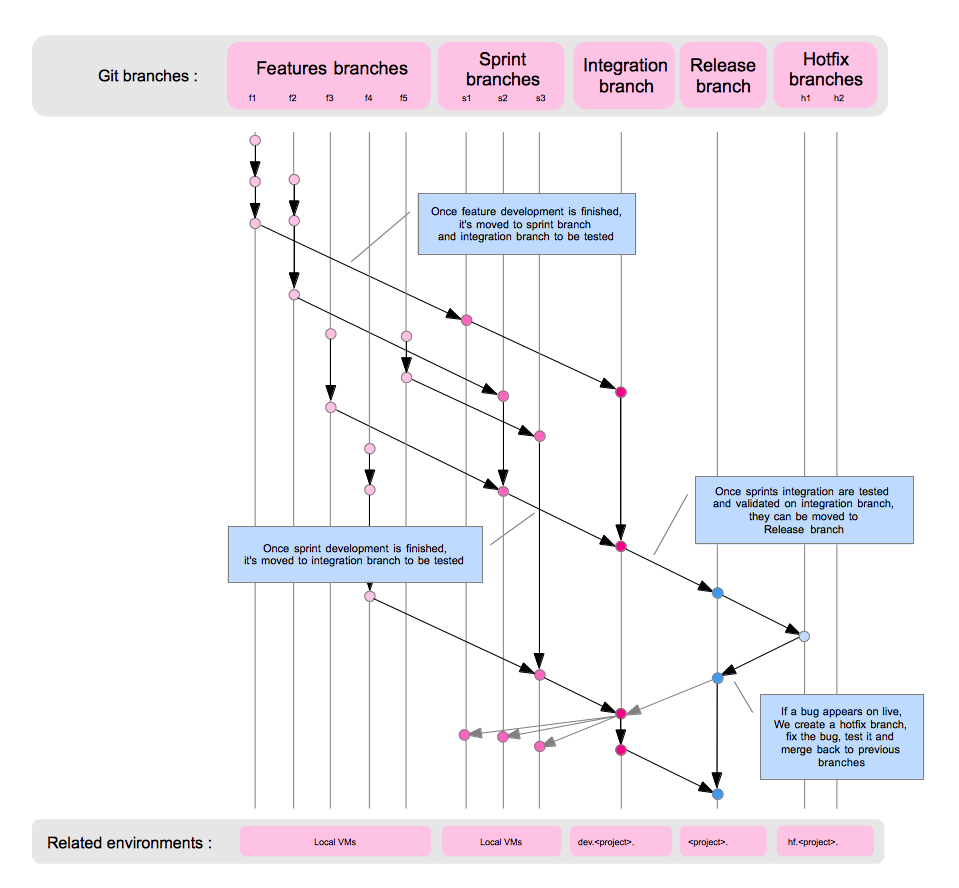

# Git architecture overview

## Branching model

This flexible model allows to develop *several features and sprints in parallel*, *deploy feature per feature or sprint per sprint*, and give *a full visibility on integration issues*.

###  Features branches

* Purpose : develop the features
* When : Each feature should use a specific branch
* Naming : f[task id]
* Examples : 

		f850
		f844
		f865

### Sprints branches

* Purpose : merge sprints features
* When : Each sprint should use a specific git branch
* Naming : s[version name]
* Examples : 

		s1
		s2

### Continuous Integration branch

* Purpose : merge features, sprints and detect conflicts
* When : There is only one integration branch. As soon a feature or a sprint is complete, they should be merged in integration branch in order to detect merging issues. (git hook)
* Naming : integration
* Note : this is actually "master" branch (automatically generated after first commit) renamed

### Release branch

* Purpose : User acceptance
* When : When one or several features or sprints have been tested, they should be merged into release branch
* Naming : release

### Hotfixes branches

* Purpose : fixing severe bugs on live
* When : If a severe bug appears on live, a hotfix branch should be created from last release. Once the hotfix has been tested on hotfix branch, it should be pushed back to release and integration branch
* Naming : h[task id]
* Examples :

		h750
		h856

## Global scheme

